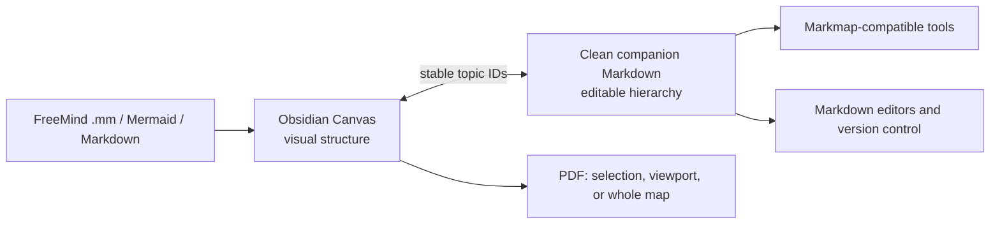

<div align="center">

<h1>ToMindMap</h1>

<h3>A keyboard-first mind-mapping environment for Obsidian Canvas</h3>

<p>Turn a regular Obsidian Canvas into a fast, spatial, Xmind-inspired workspace—with automatic branch layout, directional navigation, rich Markdown, bidirectional file sync, and portable exports.</p>

<p>
  <a href="https://github.com/TomSzenessy/Obsidian-Mindmap"></a>
  <a href="https://obsidian.md/"></a>
  
  
</p>

<p>
  <a href="#installation">Installation</a> ·
  <a href="#quick-start">Quick start</a> ·
  <a href="#keyboard-reference">Keyboard reference</a> ·
  <a href="#bidirectional-markdown-sync">Markdown sync</a> ·
  <a href="#troubleshooting">Troubleshooting</a>
</p>

</div>

---

## Why ToMindMap?

Obsidian Canvas is an excellent spatial workspace, but its default interaction model is intentionally general-purpose. ToMindMap adds a focused mind-mapping layer when you want hierarchy, speed, and flow.

The core idea is simple:

> Select a topic, type to edit, press `Enter` for a sibling, press `Tab` for a child, and use the arrow keys to move through the map.

There is no separate editing tool to activate. A selected card is in navigation mode until you type. `Enter` finishes editing; `Shift` + `Enter` inserts a line break. The result is a fluid keyboard workflow that feels closer to a dedicated mind-mapping application while retaining native Canvas files and Obsidian-rendered Markdown.

## Highlights

| Capability | What it gives you |
| --- | --- |
| Keyboard-first authoring | Create, edit, restructure, delete, and navigate without leaving the keyboard |
| Intelligent spatial navigation | Arrow-key targeting uses a straight corridor, an adaptive viewport wedge, deterministic tie-breaking, and optional edge wrapping |
| Automatic mind-map layout | Balances branches by rendered subtree height—not merely by topic count—and packs deep trees without overlap |
| Custom positioning | Turn off auto-adjust to preserve manual card positions and dimensions |
| Multiple maps per Canvas | Keep several independent central topics in one file; each tree remains independently addressable |
| Rich Markdown cards | Use formatting, tasks, links, math, code, tables, images, PDFs, and media embeds |
| Bidirectional Markdown sync | Edit the visual map or a clean companion Markdown file and keep the hierarchy synchronized |
| Markmap interoperability | Import and export portable heading/list structures with Markmap frontmatter support |
| Outline sidebar | Browse the full nested tree, search topics, manage groups, and jump directly to any card |
| Portable export | Copy as Markdown or export a selection, viewport, or complete map directly as PDF |
| Format migration | Import general Markdown, Markmap-style documents, Mermaid mindmaps, and FreeMind `.mm` files |

## How it fits together



ToMindMap keeps visual placement in the Canvas and content hierarchy in portable Markdown. This means the Markdown stays readable and useful outside Obsidian while the Canvas remains free to provide spatial layout, groups, colors, and custom positioning.

## Installation

ToMindMap is not currently published in Obsidian's Community Plugins catalog. Install it manually from this repository.

### Requirements

- Obsidian `1.5.0` or newer
- Obsidian desktop
- A vault with Community Plugins enabled and Restricted Mode turned off

### Option A: download the repository

1. Open the [ToMindMap GitHub repository](https://github.com/TomSzenessy/Obsidian-Mindmap).
2. Select **Code → Download ZIP**.
3. Extract the archive.
4. Create this folder inside your vault:

   ```text
   <Your Vault>/.obsidian/plugins/tomindmap/
   ```

5. Copy these files into that folder:

   ```text
   tomindmap/
   ├── main.js
   ├── manifest.json
   └── styles.css
   ```

6. Restart Obsidian, or open the Command Palette and run **Reload app without saving**.
7. Open **Settings → Community plugins**.
8. Select **Refresh installed plugins** if necessary, then enable **ToMindMap**.

> If `.obsidian` is hidden, enable hidden files in Finder, File Explorer, or your Linux file manager.

### Option B: clone directly into the vault

From the vault's plugin directory:

```bash
cd "/path/to/Your Vault/.obsidian/plugins"
git clone https://github.com/TomSzenessy/Obsidian-Mindmap.git tomindmap
```

Restart Obsidian and enable **ToMindMap** under **Settings → Community plugins**.

### Updating

If you installed with Git:

```bash
cd "/path/to/Your Vault/.obsidian/plugins/tomindmap"
git pull
```

If you installed from a ZIP, replace `main.js`, `manifest.json`, and `styles.css` with the files from the newest version. Keep `data.json` if you want to preserve your plugin settings.

Reload Obsidian after updating.

### Uninstalling

1. Disable **ToMindMap** in **Settings → Community plugins**.
2. Remove `<Your Vault>/.obsidian/plugins/tomindmap/`.

Your `.canvas` and synced `.md` files are ordinary vault files and are not removed with the plugin.

## Quick start

1. Create or open an Obsidian Canvas.
2. Create one text card to use as the central topic.
3. Select the card.
4. Start typing. ToMindMap enters editing automatically.
5. Press `Enter` to finish editing.
6. Press `Tab` to create a child.
7. Press `Enter` while navigating to create a sibling.
8. Move through the map with the arrow keys.

Two controls are added to the Canvas toolbar:

- **Network icon:** enable or disable mindmap mode for the current Canvas.
- **Wand / move icon:** switch between automatic layout and custom positioning.

When mindmap mode is active, mind-mapping shortcuts take priority over native Canvas movement shortcuts. When it is inactive, Canvas behaves normally.

## Keyboard reference

`Mod` means `Command` on macOS and `Ctrl` on Windows or Linux.

### Navigation mode

| Action | Shortcut |
| --- | --- |
| Start editing | Type any printable character |
| Edit without inserting text | `F2` |
| Create sibling after current topic | `Enter` |
| Create sibling before current topic | `Shift` + `Enter` |
| Create child | `Tab` |
| Insert a parent between the topic and its current parent | `Mod` + `Enter` |
| Navigate spatially | `←` `→` `↑` `↓` |
| Move to the central topic | `Mod` + `R` or `Mod` + `Home` |
| Reorder among same-side siblings | `Alt` + `↑` / `Alt` + `↓` |
| Delete topic and its complete branch | `Delete` or `Backspace` |
| Delete only the topic and retain/reconnect its children | `Mod` + `Delete` or `Mod` + `Backspace` |

Central topics are valid deletion targets. Deleting a central topic with the normal delete shortcut removes that complete tree. Deleting only the central topic keeps its children as independent roots.

### Editing mode

| Action | Shortcut |
| --- | --- |
| Save the card and return to navigation | `Enter` |
| Insert a line break inside the card | `Shift` + `Enter` |
| Create a child | `Tab` |
| Insert a parent | `Mod` + `Enter` |
| Finish editing | `Escape` |

If text is selected while editing and you create a child or sibling through a command, ToMindMap can move that selection into the new topic.

### Pointer gestures

| Action | Gesture |
| --- | --- |
| Move a topic together with all descendants | Drag the topic |
| Drag only the selected topic rather than carrying descendants | `Alt` + drag; most useful in custom positioning |
| Select an entire tree | `Alt` + click a topic |
| Zoom to a topic and all descendants | `Mod` + click a topic |
| Insert a topic into an existing connection | `Alt` + click the connection point |
| Navigate backward/forward | Mouse back/forward buttons, when enabled in settings |

Core mind-map operations are also exposed through the Obsidian Command Palette, so you can assign your own hotkeys under **Settings → Hotkeys**.

## Spatial navigation

Arrow navigation is geometric rather than limited to parent/child relationships.

ToMindMap evaluates candidates from the relevant side of the selected card:

1. It first looks for cards in a strict straight corridor.
2. It expands to a configurable buffered corridor.
3. It evaluates an adaptive wedge projected toward the relevant viewport edge.
4. It chooses by alignment and distance with stable top/left tie-breaking.
5. If no candidate remains in that direction, optional wrapping continues from the opposite viewport edge.

When the selected topic is outside the visible area, the Canvas camera follows it and restores useful surrounding context. The behavior can be tuned with **Arrow corridor buffer**, **Wrap arrow navigation**, and **Navigation zoom padding**.

## Layout modes

### Auto-adjust

Auto-adjust is designed for frictionless mind-map authoring:

- Cards resize in width and height to fit their rendered content.
- Children of a central topic are distributed across both sides.
- Branches are balanced by total rendered subtree height.
- Deep subtrees use contour-based packing to avoid overlap.
- Creating, deleting, reordering, or editing a topic reflows the affected map.
- Moving a branch carries its descendants and reflows only the relevant tree or top-level branch.
- Other independent mindmaps on the same Canvas are left alone.
- Edge attachment sides update when a branch crosses its parent.

### Custom positioning

Custom positioning preserves manual layout:

- Drag cards wherever you want.
- Resize cards to any dimensions.
- Existing cards retain their positions and sizes during Markdown reconciliation.
- Existing cards keep their manual geometry while new imported or synchronized topics begin from generated branch positions.

Switching auto-adjust back on lets ToMindMap resize and organize the map again.

### Branch tools

The Command Palette includes:

- **Re-layout mind map**
- **Resize & re-layout selected subtree**
- **Resize all nodes to fit content**
- **Flip branch to other side**
- **Toggle balanced layout**
- **Detach subtree as independent tree**
- **Apply branch colors**

## Multiple maps, groups, and the outline

A single Canvas can contain several independent mindmaps. Each root is treated as a separate tree.

The **Map outline** sidebar presents the complete nested hierarchy rather than only central topics:

- Navigate to any topic.
- Expand and collapse nested branches.
- Filter the complete outline.
- See selection mirrored between the Canvas and the outline.
- Copy stable links to individual topics.
- Select multiple ungrouped roots and create a Canvas group.
- Drag complete trees between groups.
- Rename groups from the outline.
- Automatically pack several mindmaps inside a group with **Layout forest**.

Groups and exact Canvas placement are visual organization. The portable Markdown hierarchy stores topics and relationships, not custom pixel coordinates.

## Rich Markdown topics

Cards use Obsidian's Markdown rendering and can preserve:

- **Bold**, *italic*, ~~strikethrough~~, and ==highlight==
- Inline code and fenced code blocks
- Ordered and unordered lists
- Task checkboxes
- Inline and block LaTeX / KaTeX
- Markdown tables
- Standard Markdown links
- Obsidian wikilinks and embeds
- Images and animated images
- PDFs
- Audio and video
- HTML media elements
- Links to other Canvas topics

Checkboxes can be toggled directly from the rendered card. Local media references can be validated from the Canvas menu. Missing files are highlighted in red and include the unresolved target in the card indicator.

## Bidirectional Markdown sync

Open the Canvas three-dot menu and choose **Sync to Markdown file**.

For `Project.canvas`, ToMindMap creates:

```text
Project Mindmap.md
```

If that file already exists, the next available name is used:

```text
Project Mindmap 2.md
Project Mindmap 3.md
```

The Canvas and Markdown file then synchronize in both directions:

- Editing a Canvas topic updates the Markdown hierarchy.
- Editing the Markdown hierarchy updates the Canvas.
- Topic identity is maintained with stable IDs stored in compact YAML frontmatter.
- The Markdown headings and lists remain clean—IDs are not appended to visible topic lines.
- Renaming the Markdown file keeps the link intact.
- Deleting either file does not delete the other; the surviving file is detached.
- Detaching from the Canvas menu leaves both files untouched.
- Multiple independent Canvas roots are written as multiple top-level Markdown sections.
- New Markdown topics receive stable IDs automatically.
- Renames, insertions, and reordering are reconciled without relying solely on topic names.

An example synchronized document:

```markdown
---
title: "Project"
markmap:
  colorFreezeLevel: 2
tomindmap:
  version: 1
  topicIds: ["a1b2c3d4","e5f6a7b8"]
  topicKeys: ["1abc","2def"]
  topicLabels: ["Project","Research"]
---

# Project
- Research
  - Sources
  - Questions
```

The `tomindmap` block is synchronization metadata. It is kept at the top so the editable document body remains normal Markdown.

> Positioning is deliberately not serialized into Markdown. If a Canvas is reconstructed from its companion file, all content and hierarchy are retained and a fresh automatic layout is generated.

When editing both representations at the same time, the most recently processed change wins. For large restructures, finish the edit in one representation before continuing in the other.

### Convert an existing note

Right-click a Markdown file in Obsidian's file explorer and choose **Convert to mindmap**.

ToMindMap will:

1. Create a same-folder Canvas with the same base name.
2. Import the document hierarchy.
3. Generate a balanced visual layout.
4. Link the Canvas and original Markdown file bidirectionally.
5. Add stable synchronization metadata without cluttering the document body.

Deleting either file later only detaches the relationship.

## Markmap interoperability

[Markmap](https://markmap.js.org/) turns Markdown hierarchy into an interactive mindmap. ToMindMap follows the same portable foundation: headings, nested lists, and Markdown blocks.

ToMindMap supports Markmap-oriented documents containing:

- YAML frontmatter and a `markmap` options block
- Headings and nested lists
- Checkboxes
- Links
- KaTeX math
- Fenced code blocks
- Tables
- Standalone images
- Common inline Markdown formatting

The **Markmap export frontmatter** setting controls whether new exports include a `markmap` block. **Markmap color freeze level** controls the default `colorFreezeLevel` written there. Imported frontmatter is preserved.

ToMindMap does **not** bundle Markmap or use it as a runtime renderer. It has its own Canvas-aware parser, serializer, layout engine, and synchronization layer. “Markmap-compatible” means the generated Markdown is intended to remain useful in Markmap and other hierarchy-based Markdown tools. Rendering details can vary between applications.

## Import formats

### Markdown

Import by pasting text or choosing a file from the Canvas menu. Supported structures include:

- Markmap-style Markdown
- Standard heading hierarchies
- Nested unordered lists
- Ordered lists
- Rich Markdown blocks
- Multiple top-level roots

### Mermaid mindmap syntax

Fenced Mermaid mindmap structures can be converted into Canvas topics. Positioning is regenerated.

### FreeMind

Use **Import mind map (.mm) file to canvas** from the Command Palette or a folder context menu. ToMindMap reads FreeMind-style node hierarchy and left/right branch information, then creates a new Canvas.

## Export

### Markdown

From the Canvas menu or Command Palette:

- **Copy whole mind map as Markdown**
- **Sync / detach Markdown file**

Exported Markdown is suitable for version control, plain-text editing, and hierarchy-based Markdown mind-mapping tools.

### PDF

PDF export is available for:

- The current selection
- The visible viewport
- The complete Canvas file

PDFs are written directly to the operating system's `Downloads` folder. No print dialog is opened. The page follows the map's natural aspect ratio instead of applying a forced rotation, and filename collisions receive a numeric suffix.

## Canvas menu

ToMindMap adds these actions to Obsidian's native Canvas three-dot menu:

- Sync to / detach from Markdown
- Copy the complete map as Markdown
- Import Markdown from pasted text
- Import a Markdown file
- Validate local media and embeds
- Export selection as PDF
- Export viewport as PDF
- Export the complete file as PDF

Topic context menus also include **Copy node link**. Opening that link returns to the correct Canvas and selects the topic by stable ID.

## Settings

Open **Settings → ToMindMap**.

| Setting | Default | Purpose |
| --- | ---: | --- |
| Default mindmap mode | On | Enables mindmap behavior for new or unconfigured canvases |
| Default auto-adjust | On | Resizes and reflows maps automatically |
| Auto-color branches | On | Assigns distinct colors to top-level branches |
| Horizontal gap | `80 px` | Space between parent and child columns |
| Vertical gap | `20 px` | Minimum spacing between sibling subtrees |
| Default node width | `300 px` | Initial width of new cards |
| Minimum auto width | `180 px` | Lower width limit in auto-adjust |
| Maximum auto width | `420 px` | Upper width limit in auto-adjust |
| Default node height | `60 px` | Initial/minimum automatic card height |
| Max node height | `300 px` | Maximum automatic height before content scrolls |
| Mouse back/forward navigation | Off | Uses mouse navigation buttons for map history |
| Wrap arrow navigation | On | Continues from the opposite viewport edge |
| Arrow corridor buffer | `40 px` | Tolerance around the straight navigation path |
| Navigation zoom padding | `200 px` | Context shown around a newly selected topic |
| Markmap export frontmatter | On | Adds portable Markmap options to new Markdown exports |
| Markmap color freeze level | `2` | Sets exported `colorFreezeLevel` from 0–10 |

Canvas-specific mindmap and auto-adjust choices are saved in the Canvas file.

## Command Palette

Search for “mindmap” in Obsidian's Command Palette to access all operations, including:

- Topic creation, editing, parent insertion, and both deletion modes
- Directional navigation and navigation history
- Branch flipping and balancing
- Subtree and complete-map resizing
- Re-layout and forest layout
- Mindmap mode and auto-adjust toggles
- Branch coloring
- Markdown import, copy, and sync
- FreeMind import
- Missing-media validation
- Selection, viewport, and whole-file PDF export

Commands can be assigned custom shortcuts under **Settings → Hotkeys**.

## Data and privacy

- ToMindMap works with local files in your Obsidian vault.
- It does not include telemetry.
- It does not require an account or hosted synchronization service.
- Canvas-to-Markdown synchronization uses vault files, not a remote database.
- PDF export writes only to your local `Downloads` folder.
- Markmap compatibility does not introduce a Markmap runtime or network dependency.

Remote images or media referenced in your own Markdown may still be loaded by Obsidian according to Obsidian's normal behavior.

## Troubleshooting

### ToMindMap does not appear in Community plugins

Confirm that the directory is not accidentally nested:

```text
Correct:
.obsidian/plugins/tomindmap/manifest.json

Incorrect:
.obsidian/plugins/tomindmap/Obsidian-Mindmap-main/manifest.json
```

Verify that `main.js`, `manifest.json`, and `styles.css` are present, then restart Obsidian or refresh installed plugins.

### Arrow keys move cards instead of navigating

Check that:

1. Mindmap mode is active—the network toolbar icon should be highlighted.
2. Exactly one text topic is selected.
3. The topic is not currently being edited.
4. Focus is inside the Canvas rather than another input or sidebar.

ToMindMap only takes shortcut priority while mindmap mode is active.

### The map moves when I wanted manual placement

Switch the wand icon to **Custom positioning**. Manual positions and sizes remain until auto-adjust is enabled again.

### The Markdown file is not updating

Open the Canvas three-dot menu. If it says **Sync to Markdown file**, the files are currently detached. Enable sync again to create a new companion file.

If the linked Markdown file was deleted, ToMindMap intentionally detaches rather than recreating or deleting either side.

### A media card is red

The topic references a local image, PDF, audio, video, or embed that cannot be resolved. Use **Validate local media and embeds** and check the path shown on the card.

### I cannot find an exported PDF

PDF files are saved directly to your operating system's `Downloads` directory. The notice after export includes the generated filename.

### An Obsidian update changed Canvas behavior

ToMindMap integrates deeply with Canvas interaction and rendering. If a new Obsidian release changes those internals, include the following in a [GitHub issue](https://github.com/TomSzenessy/Obsidian-Mindmap/issues):

- ToMindMap version
- Obsidian version
- Operating system
- Exact reproduction steps
- A small sample Canvas or Markdown file, if possible

## Design principles

ToMindMap is built around five principles:

1. **Flow over modes.** Navigation is the default; typing is editing.
2. **Locality over disruption.** Changes reflow the relevant branch or tree, not unrelated maps.
3. **Geometry over guesswork.** Navigation follows visible spatial intent.
4. **Portable content over proprietary structure.** Markdown carries meaning; Canvas carries presentation.
5. **Safe detachment over destructive coupling.** Removing one synchronized file never deletes the other.

## Acknowledgements

ToMindMap is inspired by the fluid keyboard workflows of dedicated tools such as [Xmind](https://xmind.com/), the portability of [Markmap](https://markmap.js.org/), the established `.mm` hierarchy format used by FreeMind, and the flexibility of [Obsidian Canvas](https://obsidian.md/canvas).

ToMindMap is an independent project and is not affiliated with or endorsed by Obsidian, Xmind, Markmap, Mermaid, or FreeMind.

---

<div align="center">

<p><strong>Think in structure. Move in space. Keep the result portable.</strong></p>

<p>
  <a href="https://github.com/TomSzenessy/Obsidian-Mindmap/issues">Report an issue</a> ·
  <a href="https://github.com/TomSzenessy/Obsidian-Mindmap">View the repository</a>
</p>

</div>
